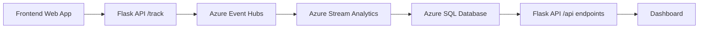

# ShopStream – Real-Time Clickstream Analytics (Azure)

## Demo Video Link
https://youtu.be/9RjYwV0fiE0

## Overview

This project implements a **real-time clickstream analytics pipeline** using Azure services.
User interaction events from a web store are captured, enriched, streamed, processed, and visualized.

The system demonstrates how to transform **raw event data into meaningful insights** such as:

* Device type distribution
* Traffic spike detection

---

## Architecture



---

## Data Flow

1. **Frontend (client.html)**

   * Captures user actions (click, add to cart, page view)
   * Enriches events with:

     * deviceType
     * browser
     * os

2. **Flask Backend (/track)**

   * Receives event JSON
   * Adds timestamp
   * Sends events to Azure Event Hubs

3. **Azure Event Hubs**

   * Acts as the streaming ingestion layer

4. **Azure Stream Analytics**

   * Processes incoming events in real-time
   * Uses **Tumbling Window (1 minute)**
   * Performs aggregation and filtering

5. **Azure SQL Database**

   * Stores processed analytics results:

     * DeviceTypeStats
     * TrafficSpikes

6. **Flask API**

   * `/api/device-stats`
   * `/api/traffic-spikes`

7. **Dashboard**

   * Displays analytics results in real-time

---

## Stream Analytics Queries

### 1. Device Type Breakdown

```sql
WITH DeviceCounts AS
(
    SELECT
        System.Timestamp() AS windowEnd,
        deviceType,
        COUNT(*) AS eventCount
    FROM clickstreamInput TIMESTAMP BY [timestamp]
    GROUP BY deviceType, TumblingWindow(minute, 1)
)
SELECT
    windowEnd,
    deviceType,
    eventCount
INTO deviceTypeOutput
FROM DeviceCounts;
```

---

### 2. Traffic Spike Detection

```sql
SELECT
    System.Timestamp() AS windowEnd,
    COUNT(*) AS totalEvents,
    CASE
        WHEN COUNT(*) > 20 THEN 'SPIKE'
        ELSE 'NORMAL'
    END AS spikeStatus
INTO spikeOutput
FROM clickstreamInput TIMESTAMP BY [timestamp]
GROUP BY TumblingWindow(minute, 1);
```

---

## Database Tables

### DeviceTypeStats

| Column     | Description                         |
| ---------- | ----------------------------------- |
| windowEnd  | End of time window                  |
| deviceType | Device type (desktop/mobile/tablet) |
| eventCount | Number of events                    |

### TrafficSpikes

| Column      | Description            |
| ----------- | ---------------------- |
| windowEnd   | End of time window     |
| totalEvents | Total events in window |
| spikeStatus | NORMAL or SPIKE        |

---

## Dashboard Features

The dashboard displays:

### KPI Metrics

* Latest Window Total
* Top Device Type
* Top Device Count
* Spike Status

### Visualizations

* Device Type Breakdown (bar chart)
* Traffic Spike Detection (table)

---

## Key Concepts Demonstrated

* Real-time data ingestion (Event Hubs)
* Stream processing (Stream Analytics)
* Windowing (Tumbling Window)
* Event enrichment
* Cloud data pipeline design
* Data visualization

---

## Setup Instructions

### 1. Install dependencies

```bash
pip install -r requirements.txt
```

### 2. Set environment variables (PowerShell)

```powershell
$env:EVENT_HUB_CONNECTION_STR="your_event_hub_connection_string"
$env:EVENT_HUB_NAME="clickstream"
$env:SQL_CONNECTION_STRING="your_sql_connection_string"
```

### 3. Run application

```bash
python app.py
```

### 4. Open browser

```text
http://127.0.0.1:8000/
http://127.0.0.1:8000/dashboard
```

---

## Design Decisions

* **Event Hubs** chosen for scalable ingestion
* **Stream Analytics** used for real-time processing without managing infrastructure
* **SQL Database** used for structured analytics storage
* **Flask API** provides a simple backend interface
* **Dashboard** built with polling for simplicity

---

## Conclusion

This project demonstrates a complete **end-to-end real-time analytics system** on Azure, transforming raw clickstream data into actionable insights through streaming architecture.
